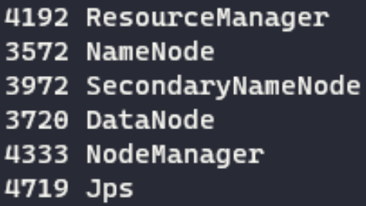

<br />
<div align="center">
  <h1 align="center">Hadoop - Big Data Solutions</h1>
</div>

Contributors (K1 Group 9)
1. Bernanda NR
2. Muhammad Irsyad F 
3. Daffa Anis F
4. Prima Salih

Overview:
-------
This README provides an introduction to Hadoop, a powerful framework for processing and analyzing big data. It explains the traditional approach to handling big data, the limitations it poses, and how Google's solution, MapReduce, inspired the development of Hadoop.

Traditional Approach:
-------
In the traditional approach, enterprises rely on a single computer system to store and process big data. They use databases provided by vendors like Oracle or IBM for data storage and analysis. While this approach works well for smaller datasets, it becomes challenging to process massive amounts of scalable data using a single database. The limitations of this approach led to the need for a more efficient solution.

Google's Solution - MapReduce:
-------
Google introduced an algorithm called MapReduce to address the challenges of processing large-scale data. MapReduce breaks down the data processing task into smaller parts, distributes them across multiple computers, and collects the results to form the final dataset. This approach enables parallel processing and eliminates the bottleneck created by a single database.

Introducing Hadoop:
-------
Inspired by Google's solution, Doug Cutting and his team developed Hadoop as an open-source project. Hadoop utilizes the MapReduce algorithm to enable parallel processing of data.

Hadoop provides a comprehensive framework for developing applications that can perform statistical analysis on vast amounts of data. By dividing the data into smaller chunks and processing them in parallel across a cluster of computers, Hadoop offers scalability and efficiency for big data analysis.

Hadoop's Components:
Hadoop consists of two primary components:

- Hadoop Distributed File System (HDFS): HDFS is a distributed file system designed to store large volumes of data across multiple machines in a Hadoop cluster. It ensures high fault tolerance and leverages data locality, processing data on the same machine where it resides.

- MapReduce: MapReduce is a programming model and computational algorithm used for distributed processing of data in a Hadoop cluster. It partitions the input data into smaller subsets, processes them in parallel, and combines the results to produce the final output.

Benefits and Applications:
-------
Hadoop has gained popularity as a leading big data solution due to its ability to handle large-scale data processing, fault tolerance, and scalability. It finds applications in various domains, including data analytics, machine learning, and data warehousing.

Additional Resources:
-------
For more in-depth information about Hadoop and its applications, please refer to the following resources:

- Hadoop Official Website: https://hadoop.apache.org/
- Hadoop Documentation: https://hadoop.apache.org/documentation/
- Books: "Hadoop: The Definitive Guide" by Tom White, "Hadoop in Action" by Chuck Lam

-------

<br />
<div align="center">
  <h1 align="center">Hadoop Installation and Basic Word Count Tutorial</h1>
</div>

*The installation step by step is aimed for Linux user* 

Prerequisite
---------
Before starting with the installation, make sure your Linux system supports SSH and you can SSH into the localhost or other hosts for multi-node setup. You can use the following tutorial, [SSH Installation Tutorial](https://www.cyberciti.biz/faq/how-to-install-ssh-on-ubuntu-linux-using-apt-get/).

It is suggested to use Java 8 for Hadoop. You can install Java 8 by running the following commands:
```
sudo apt install openjdk-8-jre-headless
sudo apt-get install openjdk-8-jdk
```
Download and Extract
---------
1. Download Hadoop from the official website: Hadoop Downloads.
2. Choose the desired version (e.g., hadoop-3.3.5) and download the tar.gz file.
3. Extract the downloaded file using the appropriate command. For example, if the downloaded file is hadoop-3.3.5.tar.gz, you can use the command:
```
tar -xvzf hadoop-3.3.5.tar.gz
```
4. Change to the extracted directory:
```
cd hadoop-3.3.5/
```

Configuration
---------
Navigate to the etc/hadoop/ directory inside the extracted Hadoop directory (hadoop-3.3.5/ in this case). You will find five configuration files that need to be edited before running the services. You can follow this configuration as it is the same in general.
1. `hadoop-env.sh`: Edit this file to set environment variables for Hadoop. Add this following line
`export JAVA_HOME=/usr/lib/jvm/java-1.8.0-openjdk-amd64`
3. `core-site.xml`: Configure the core properties of Hadoop, such as the filesystem and default port.
```
<configuration>
     <property>
         <name>fs.defaultFS</name>
         <value>hdfs://localhost:9000</value>
     </property>
</configuration>
```
3. `hdfs-site.xml`: Configure the Hadoop Distributed File System (HDFS) properties, including replication factor and block size.
```
<configuration>
  <property>
      <name>dfs.namenode.name.dir</name>
      <value>/home/{user}/hadoop/dfs/namenode</value>
  </property>
  <property>
      <name>dfs.datanode.data.dir</name>
      <value>/home/{user}/hadoop/dfs/datanode</value>
  </property>
  <property>
      <name>dfs.replication</name>
      <value>1</value>
  </property> 
  <property>
    <name>dfs.namenode.secondary.http-address</name>
    <value>{Host Name, e.g. DESKTOP-41R7O0N:50090}</value>
  </property>
</configuration>
```
Note that you need to create the directory first for the namenode and datanode dir.

4. `mapred-site.xml`: Configure the MapReduce framework properties, if required.
```
<configuration>
     <property>
         <name>mapreduce.framework.name</name>
         <value>yarn</value>
     </property>
     <property>
         <name>mapreduce.application.classpath</name>
         <value>$HADOOP_MAPRED_HOME/share/hadoop/mapreduce/*:$HADOOP_MAPRED_HOME/share/hadoop/mapreduce/lib/*</value>
     </property>
     <property>
 	 <name>mapreduce.child.java.opts</name>
	 <value>-XX:+UseParallelGC -Xmx4g</value>
     </property>
</configuration>
```

5. `yarn-site.xml`: Configure properties related to Yet Another Resource Negotiator (YARN), the resource management framework used by Hadoop.
```
<configuration>
    <property>
        <name>yarn.nodemanager.aux-services</name>
        <value>mapreduce_shuffle</value>
    </property>
   <property>
        <name>yarn.nodemanager.auxservices.mapreduce.shuffle.class</name> 
        <value>org.apache.hadoop.mapred.ShuffleHandler</value>
   </property>
    <property>
        <name>yarn.nodemanager.env-whitelist</name>
        <value>JAVA_HOME,HADOOP_COMMON_HOME,HADOOP_HDFS_HOME,HADOOP_CONF_DIR,CLASSPATH_PREPEND_DISTCACHE,HADOOP_YARN_HOME,HADOOP_MAPRED_HOME</value>
    </property>
</configuration>
```

Start the Service
---------
1. After configuration, you need to format the namenode first. Navigate to `bin/` then run the following command 
`hdfs namenode -format`
2. Start the service by go to `sbin/` and run sthe `start-all.sh` to start. Verify the running process by typing `jps` command. You expected to have 6 services running :
 

Word Count Program using HadoopMapReducer
---------
You can follow the complete tutorial from the official hadoop documentation, [MapReduce Tutorial](https://hadoop.apache.org/docs/stable/hadoop-mapreduce-client/hadoop-mapreduce-client-core/MapReduceTutorial.html).

The tutorial will guide you through the process of compiling the code, building it into a JAR file, putting the input file into HDFS, and running the Word Count program using MapReduce.

-------

<br />
<div align="center">
  <h1 align="center">Hadoop (Single Node) MapRed vs Java TreeMap</h1>
</div>

Overview
---------
This repository compares the performance of Hadoop (single node) MapReduce and Java TreeMap for a specific problem. The aim is to analyze the advantages and disadvantages of each approach in terms of simplicity and optimization.

Test Machine
------------
The experiments were conducted on an Ubuntu 20.04 machine with 16 GB of RAM and 4 CPU cores.

Dataset
-------
The dataset used for the experiments consists of six text files of varying sizes:

- File 1: 0.1 MB
- File 2: 1   MB
- File 3: 10  MB
- File 4: 20  MB
- File 5: 40  MB
- File 6: 60  MB
- File 7: 80  MB
- File 8: 100 MB
- File 9: 200 MB

To generate those file, we write python script, you can find it in [text-generator](https://github.com/bernanda0/wordcounting/tree/main/text_generator). To use it, simply run  
`python text.py <file_size_in_mb>`

Comparing output
--------
Before we do the comparation, we need to make sure that both program produce the same output.   


JAVA TREEMAP
--------
The code for the word count is shown as below, you can also check in this [folder](https://github.com/bernanda0/wordcounting/tree/main/word_count_no_hadoop). 
```
import java.io.File;
import java.io.FileNotFoundException;
import java.util.Map;
import java.util.Scanner;
import java.util.TreeMap;

public class WordCounter {
    public static void main(String[] args) {
        // Check if the file name argument is provided
        if (args.length < 1) {
            System.out.println("Usage : java WordCounter <file_name>");
            return;
        }

        String fileName = args[0];
        Map<String, Integer> wordCounts = new TreeMap<>();

        try {
            File file = new File(fileName);
            Scanner scanner = new Scanner(file);

            while (scanner.hasNext()) {
                String word = scanner.next();
                if (word.length() > 0) {
                    int count = wordCounts.getOrDefault(word, 0);
                    wordCounts.put(word, count + 1);
                }
            }
            scanner.close();
        } catch (FileNotFoundException e) {
            System.out.println("File not found: " + fileName);
            return;
        }
    }
}
```
To get the average running time and make life easier, we create simple shell script to automate the number of iteration. You can also find it in this folder [folder](https://github.com/bernanda0/wordcounting/tree/main/word_count_no_hadoop). To use it, first place the test file (.txt) to the `input` folder, and then run the following command
`run.sh <number_of_iteration> <file_name>`


Hadoop (uber false)
--------
After putting the text file in hdfs, navigate to the folder where `.jar` file exist, in our case it located in [folder](https://github.com/bernanda0/wordcounting/tree/main/word_count_hadoop). Run the map reduce process by the following command
`hadoop jar wc.jar WordCount <hdfs_input_directory> <hdfs_output_directory>`

Note that after the mapred process begin, you cannot use the same output directory as it will throw error. 

We calculate the running time by substracting the time log produce by hadoop, from the start of the mapred process until reduced phase completed.


Hadoop (uber true)
--------
Addition for the comparation, we also try about uber mode in hadoop, to configure this add the followng property to the `mapred-site.xml`
```
<property>
    <name>mapreduce.job.ubertask.enable</name>
    <value>true</value>
</property>
```
After that we do the same thing as before to begin the mapred process of word counting.

Running Time
---------------
<table>
  <thead>
    <tr>
      <th>Size (MB)</th>
      <th>TreeMap</th>
      <th>Hadoop</th>
      <th>Hadoop (Uber)</th>
    </tr>
  </thead>
  <tbody>
    <tr>
      <td>0.1</td>
      <td>88</td>
      <td>7078</td>
      <td>1043</td>
    </tr>
    <tr>
      <td>1</td>
      <td>244</td>
      <td>7089</td>
      <td>2055</td>
    </tr>
    <tr>
      <td>10</td>
      <td>1433</td>
      <td>9095</td>
      <td>3057</td>
    </tr>
    <tr>
      <td>20</td>
      <td>2694</td>
      <td>10103</td>
      <td>5060</td>
    </tr>
    <tr>
      <td>40</td>
      <td>5297</td>
      <td>13106</td>
      <td>7064</td>
    </tr>
    <tr>
      <td>60</td>
      <td>8013</td>
      <td>16122</td>
      <td>10061</td>
    </tr>
    <tr>
      <td>80</td>
      <td>10971</td>
      <td>18123</td>
      <td>12082</td>
    </tr>
    <tr>
      <td>100</td>
      <td>13477</td>
      <td>21135</td>
      <td>14095</td>
    </tr>
    <tr>
      <td>200</td>
      <td>26765</td>
      <td>36200</td>
      <td>30102</td>
    </tr>
  </tbody>
</table>

The output is measured in ms.

Graph
-----


Program Results
---------------
Both the Java TreeMap and Hadoop MapReduce implementations produce the same results for the given problem.

- Java TreeMap: The Java TreeMap implementation offers efficient key-value pair storage and retrieval with a time complexity of O(log n). It is particularly suited for problems involving mapping and counting.

- Hadoop MapReduce (uber false): This implementation utilizes the Hadoop framework's MapReduce paradigm on a single-node setup. It avoids the overhead of inter-process communication between the Application Master (AM) and Resource Manager (RM). However, the parallelism and data locality advantages of distributed processing are not fully utilized due to the single-node configuration.

- Hadoop MapReduce (uber true): This implementation also uses Hadoop MapReduce on a single-node setup but runs the job in "uber" mode, where the entire MapReduce process executes in a single JVM. This mode aims to reduce the overhead of cluster setup and management but still operates on a single machine.

Conclusion
----------
Based on the experiments and analysis, the following observations can be made:

- For small-scale problems or scenarios where the data can fit in memory, the Java TreeMap implementation provides a simpler and optimized solution. Its O(log n) time complexity ensures efficient mapping and counting operations.

- Hadoop MapReduce, while powerful for large-scale distributed processing, incurs additional overhead for cluster setup and management. In the single-node setup used here, the benefits of parallelism and data locality are not fully realized.

Consider the specific requirements of your problem to determine the appropriate approach. If the dataset is small and the problem can be effectively solved on a single machine, the Java TreeMap approach may be more suitable. However, for large-scale distributed processing and leveraging the full Hadoop ecosystem, Hadoop MapReduce is recommended.
